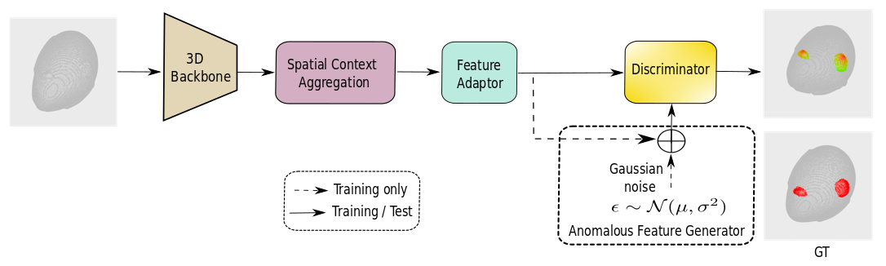

## Efficient Industrial Point Cloud Anomaly Detection via Spatial Context Aggregation



## Download

+ To download the Real3D-AD dataset, click [real3d-ad-pcd.zip(google drive)](https://drive.google.com/file/d/1oM4qjhlIMsQc_wiFIFIVBvuuR8nyk2k0/view?usp=sharing) or [real3d-ad-pcd.zip(baidu disk: vrmi)](https://pan.baidu.com/s/1orQY3DjR6Z0wazMNPysShQ)

+ For Industrial3D-AD dataset, Available on request — please email the corresponding author for access.

### Data preparation
- Download real3d-ad-pcd.zip and extract into `./data/`
```
data
├── airplane
    ├── train
        ├── 1_prototype.pcd
        ├── 2_prototype.pcd
        ...
    ├── test
        ├── 1_bulge.pcd
        ├── 2_sink.pcd
        ...
    ├── gt
        ├── 1_bulge.txt
        ├── 2_sink.txt
        ... 
├── car
...
```

### Checkpoint preparation

| Backbone          | Pretrain Method                                                                                                                                                                 |
| ----------------- | ------------------------------------------------------------------------------------------------------------------------------------------------------------------------------- |
| Point Transformer | [Point-MAE](https://github.com/Pang-Yatian/Point-MAE/releases/download/main/pretrain.pth)                                                                                       |

- Download checkpoints and move them into `./checkpoints/`

### Detailed training and testing instructions will be released once the paper is published.

Our code is built on [BTF](https://github.com/eliahuhorwitz/3D-ADS), [M3DM](https://github.com/nomewang/M3DM), [PatchCore](https://github.com/amazon-science/patchcore-inspection), and [Real3D-AD](https://github.com/M-3LAB/Real3D-AD). Thank you to the authors of these fantastic projects for open‑sourcing their work!

